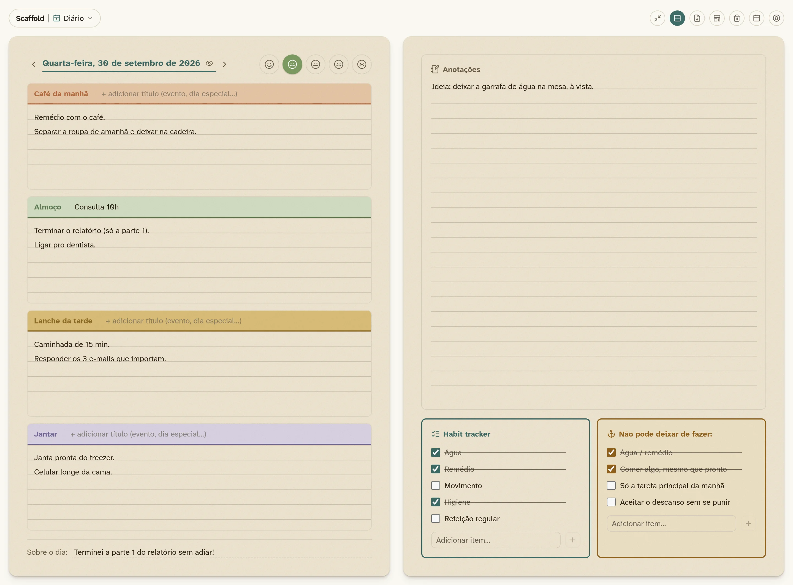
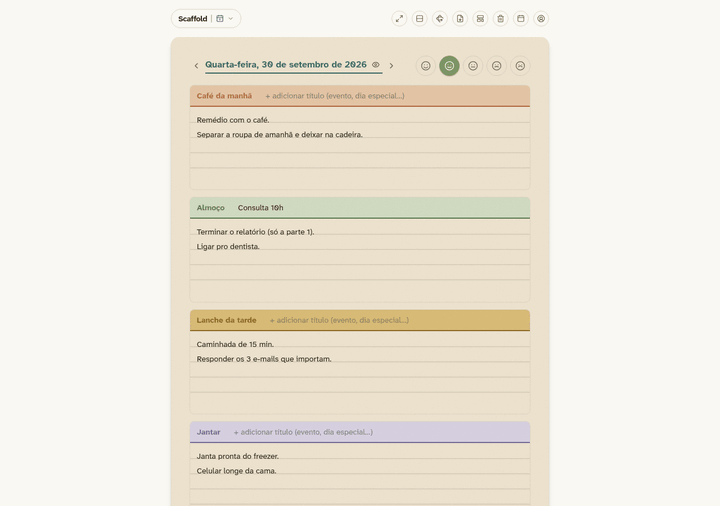
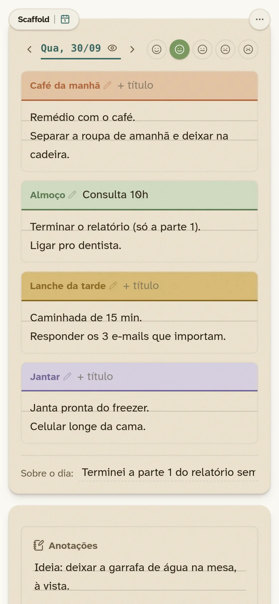
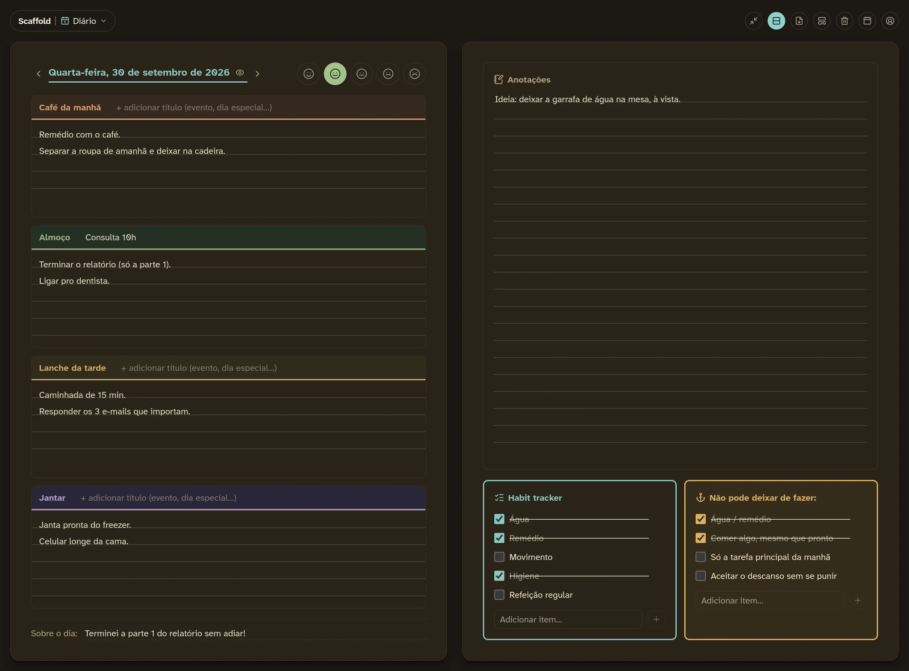
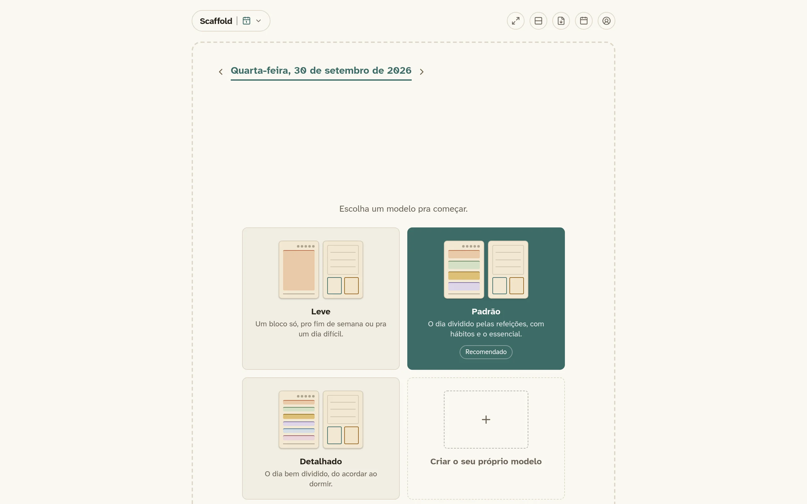
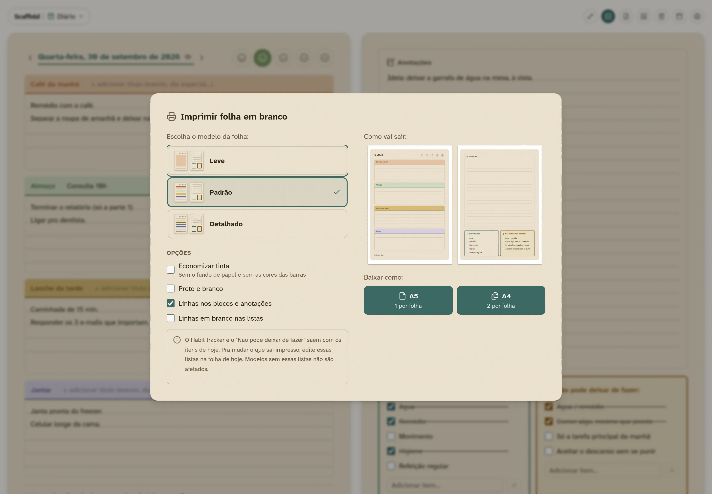
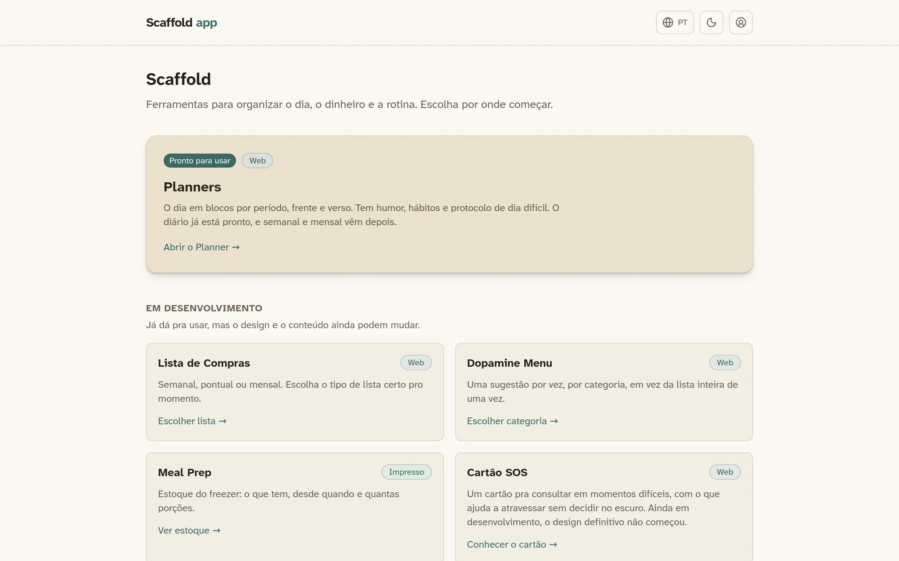

<div align="center">


# Scaffold

**Routine and environment for ADHD, on paper and on screen.**

A reference manual and an app that puts the manual into practice, for people with ADHD and the people who support them.

[**Open the app**](https://scaffold-app.scaffold-app.workers.dev) · [**Read the manual**](https://felipiadenildo.github.io/scaffold/) (Portuguese) · [Send feedback](#contact)

**English** · [Português](README.pt-BR.md) · [Español](README.es.md)

[](https://github.com/felipiadenildo/scaffold/actions/workflows/ci.yml)
[](LICENSE)
[](https://creativecommons.org/licenses/by-nc-sa/4.0/)


<br />



</div>

## Contents

- [About](#about)
- [The app](#the-app)
- [The manual](#the-manual)
- [Screenshots](#screenshots)
- [Principles](#principles)
- [Tech stack](#tech-stack)
- [Repository structure](#repository-structure)
- [Running locally](#running-locally)
- [Roadmap](#roadmap)
- [Contributing](#contributing)
- [License](#license)
- [Contact](#contact)

## About

A scaffold is the structure that holds a building up until it can stand on its own. This project plays that role in the routine of people with ADHD. It does not try to change the person. It organizes the environment, the paper and the screen so the day relies less on memory and willpower.

There are two parts that work together:

| | What it is | Where |
|---|---|---|
| **Manual** | Explains the why and the how to think behind each solution, with checked sources | [felipiadenildo.github.io/scaffold](https://felipiadenildo.github.io/scaffold/) |
| **App** | Puts the solutions to use, on a phone, on a computer or printed | [scaffold-app.scaffold-app.workers.dev](https://scaffold-app.scaffold-app.workers.dev) |

The screenshots below show the app in Portuguese. The app itself is also available in English and Spanish.

## The app

### Daily planner

The heart of the app. Each day is a sheet of paper with a front and a back.

- **Blocks for each part of the day**, anchored on meals, with room for an extra title (an appointment, an event).
- **Mood of the day** on a five level scale.
- **Habit tracker** and **"Don't skip"**, the minimum that holds up a hard day.
- **About the day** and **Notes** for whatever comes up.
- **Templates**: ready made ones (Light, Default and Detailed) or your own, each suggested on the weekdays you choose.
- **Printing** of blank sheets in A5 or A4 (two planners per page), with options to save ink.

<p align="center">
  
</p>

### Also in the app

- **Works offline** and can be installed as an app (PWA) on a phone or computer.
- **Your data stays on your device.** No account needed. You can download a copy and move it to another device.
- **Three languages** (Portuguese, English and Spanish) and **light and dark themes**.
- [Atkinson Hyperlegible](https://www.brailleinstitute.org/freefont/) font, designed for easier reading.

### In development

Shopping List, Dopamine Menu, Meal Prep and SOS Card can already be used in the app, but their design and content will still change. Finance (spreadsheet) and Travel (Notion checklists) are described in the manual.

## The manual

Twelve chapters on routine and environment, written in Portuguese, plus templates and a product guide:

1. Foundations
2. Physical environments
3. Analog system
4. Digital system
5. Emotional crisis protocols
6. Everyday routines
7. Health, body and cycle
8. Mid and long term planning
9. Relationships and communication
10. Automation and distractions
11. The role of those who help
12. When to seek professional help

[Read the manual](https://felipiadenildo.github.io/scaffold/)

> Scaffold is support material and does not replace professional care. If you are in crisis, contact your local emergency number or a crisis line in your country.

<div align="center">
  <div style="display: flex; gap: 8px; align-items: flex-start; justify-content: center; flex-wrap: wrap;">
    <div style="flex: 0 0 30%;">
      <br />
      <sub>On a phone</sub>
    </div>
    <div style="flex: 1; display: flex; flex-direction: column; gap: 8px;">
      <div>
        <br />
        <sub>Dark theme</sub>
      </div>
      <div>
        <br />
        <sub>Choosing a template</sub>
      </div>
    </div>
  </div>
  <div style="margin-top: 8px;">
    <br />
    <sub>Printing with preview</sub>
  </div>
  <div style="margin-top: 8px;">
    <br />
    <sub>Tool catalog</sub>
  </div>
</div>

## Principles

- **Less friction, more use.** Every screen asks for as few decisions as possible. What does not help day to day is left out.
- **Paper and screen are equals.** Everything in the app can be printed.
- **Private by default.** No account, no tracking, no server storing what you write.
- **Accessible.** Readable font, contrast in both themes, keyboard and screen reader support.
- **Grounded in sources.** The app follows the manual, and the manual cites where each idea comes from.

## Tech stack

| Part | Technologies |
|---|---|
| App | React 19, TypeScript, Vite, Tailwind CSS 4, Motion, React Router |
| Offline and install | vite-plugin-pwa (Workbox) |
| PDF | jsPDF and html2canvas-pro |
| Tests and quality | Vitest, happy-dom, oxlint |
| Manual | Astro and Starlight |
| Hosting | Cloudflare Workers (app) and GitHub Pages (manual) |

## Repository structure

```
scaffold/
├── app/
│   ├── web/        app source code (React + Vite)
│   └── print/      print templates
├── manual/         manual website (Astro + Starlight)
└── docs/           images used in this README
```

## Running locally

Requires [Node.js](https://nodejs.org/) 22 or newer.

```bash
git clone https://github.com/felipiadenildo/scaffold.git
cd scaffold/app/web
npm install
npm run dev        # http://localhost:5173
```

| Command | What it does |
|---|---|
| `npm test` | Runs the tests (Vitest) |
| `npm run lint` | Lints the code (oxlint) |
| `npm run build` | Type checks and builds for production into `dist/` |
| `npm run capturas` | Generates the images in this README (with `npm run dev` running) |

For the manual:

```bash
cd scaffold/manual
npm install
npm run dev        # http://localhost:4321/scaffold
```

## Roadmap

- [ ] Mobile improvements (dialogs on narrow screens and swiping between days)
- [ ] First use tips explaining each part of the sheet
- [ ] Weekly and monthly planners
- [ ] Optional sign in to sync across devices
- [ ] Vector PDF, with crisp text and smaller files

## Contributing

Suggestions, experience reports and fixes are very welcome, especially from people who live with ADHD or support someone who does.

- **Found a problem or have an idea?** Open an [issue](https://github.com/felipiadenildo/scaffold/issues).
- **Want to work on the code?** Fork the repository, create a branch and open a pull request explaining what changed and why. Before sending it, run `npm test`, `npm run lint` and `npm run build` in `app/web`.
- **Want to fix something in the manual?** Every manual page has an "Edit page" link that opens the file here on GitHub.

## License

- **Code** (app and manual website): [GNU Affero General Public License v3.0](LICENSE). You may use, study, modify and redistribute it. If you publish a modified version, including as a service over a network, you must make its source code available under the same license.
- **Manual content** (texts, templates and product guide): [Creative Commons BY-NC-SA 4.0](https://creativecommons.org/licenses/by-nc-sa/4.0/). It may be shared and adapted with credit, for non commercial purposes and under the same license.

Copyright © 2026 Felipi Adenildo.

## Contact

Have a suggestion, a critique or a story about how Scaffold helped (or did not)? All feedback helps the project improve.

- **Contact form:** [felipiadenildo.github.io/scaffold/contato](https://felipiadenildo.github.io/scaffold/contato/)
- **GitHub issues:** [github.com/felipiadenildo/scaffold/issues](https://github.com/felipiadenildo/scaffold/issues)
- **GitHub:** [@felipiadenildo](https://github.com/felipiadenildo)
